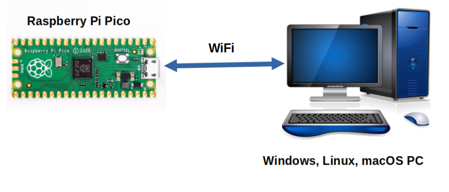

# telemetrix-rpi-pico-w

Interact and monitor a Raspberry Pi Pico W remotely from your PC using Python.
It is similar to Arduino Firmata but explicitly written for the Raspberry Pi Pico W.

You have a choice of two client APIs. One uses [Python threading](https://htmlpreview.github.io/?https://github.com/MrYsLab/telemetrix-rpi-pico-w/blob/master/html/telemetrix_rpi_pico_w/index.html) for concurrency, and the
other uses [Python asyncio.](https://htmlpreview.github.io/?https://github.com/MrYsLab/telemetrix-rpi-pico-w/blob/master/html/telemetrix_rpi_pico_w_aio/index.html)



A complete User's Guide is [available online.](https://mryslab.github.io/telemetrix-rpi-pico-w/)

The Pico W server code is available to be viewed [here.](https://github.com/MrYsLab/Telemetrix4RpiPicoW)

The following functionality is implemented in this release:

* Analog Input
* Digital Input, Digital Input Pullup, Digital Input Pulldown
* PWM output
* Loopback (for client/server link debugging)
* I2C Support
* SPI Support
* NeoPixel Support
* Servo Support
* HC-SR04 Type Sonar Distance Sensor Support
* Stepper Motor Support
* DHT 11 and 22 Humidity/Temperature Sensor Support
* Automatic board reset of the PICO W using the watchdog timer when an 
  application exits.


## To install The Client Library:


```bash
pip install telemetrix-rpi-pico-w 
```

### If you are upgrading from a previously installed version:

```bash
pip install telemetrix-rpi-pico-w --upgrade
```

## To Install The Pico-W Server Application
Follow the instructions in the [User's Guide.](https://mryslab.github.io/telemetrix-rpi-pico-w/install_pico_server/)

## Download And Run The Examples
   
1. [Download,](https://github.com/MrYsLab/telemetrix-rpi-pico-w/archive/master.zip) 
   save, and uncompress the telemetrix-rpi-pico-w Github repository. There is a directory 
   for [threaded examples](https://github.com/MrYsLab/telemetrix-rpi-pico-w/tree/master/examples)
   as well as [asyncio examples](https://github.com/MrYsLab/telemetrix-rpi-pico-w/tree/master/examples_aio).
   
2. Open the _examples_ directory and run any of the examples using Python3. You may
modify them to suit your needs.


This project was developed with [Pycharm](https://www.jetbrains.com/pycharm/?from=telemetrix-rpi-pico-w)

