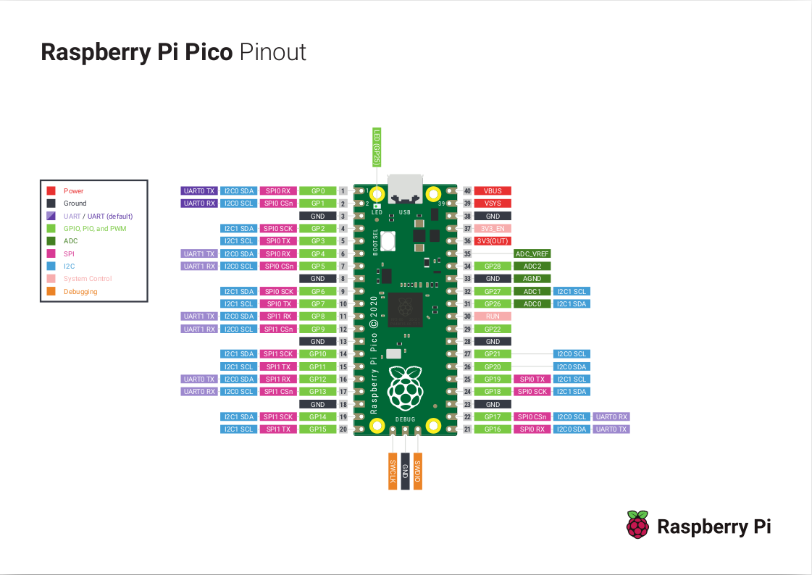

If you look at the Pico W pin-out diagram, you will see that a GPIO pin may be 
configured to operate in one of several operational modes. 



No matter the mode, when using Telemetrix, you must first explicitly set the mode 
by calling one of the _set_pin_mode_XXX_ methods for the pin. For output modes, if you try 
to perform a _write_ operation and have not first set the pin's mode, a RunTimeError 
exception is thrown.

Below, a call to digital_write for pin 5 was made before set_pin_mode_digital_output 
was called:

```angular2html
python3 no_pin_mode_set.py 
TelemetrixRpiPicoW:  Version 1.0

Copyright (c) 2022 Alan Yorinks All Rights Reserved.

Establishing IP connection...
Successfully connected to: 192.168.2.102:31335

Retrieving Telemetrix4picoW firmware ID...
Telemetrix4picoW firmware version: 1.0
Traceback (most recent call last):
  File "/home/afy/PycharmProjects/telemetrix-rpi-pico-w/ play/no_pin_mode_set.py", line 5, in <module>
    board.digital_write(pin=5, value=1)
  File "/home/afy/PycharmProjects/telemetrix-rpi-pico-w/telemetrix_rpi_pico_w/telemetrix_rpi_pico_w.py", line 384, in digital_write
    raise RuntimeError('digital_write: You must set the pin mode before '
RuntimeError: digital_write: You must set the pin mode before performing a digital write.
```


<br>
<br>

Copyright (C) 2022 Alan Yorinks. All Rights Reserved.