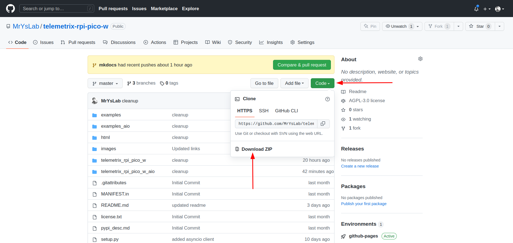

Once both the client and server software has been installed, it would be 
an excellent time 
to try an example to verify that bidirectional WI-FI communication is 
working between the server residing on the Pico W and a Python API application.

An excellent candidate is [get_cpu_temperature.py.](https://github.com/MrYsLab/telemetrix-rpi-pico-w/blob/master/examples/get_cpu_temperature.py)
It requires no additional hardware and returns the internal temperature of the Pico W CPU.

## Downloading The Repository And Extracting The Examples

To run any of the included example codes on the
[telemetrix-rpi-pico-w](https://github.com/MrYsLab/telemetrix-rpi-pico-w)
GitHub repository, click on the green Code button in the upper right corner
and then click Download ZIP. Next, extract all the files.

## Running An Example

1. Go to the examples directory.
2. Select an example you wish to run.
3. Modify the IP address in the example to match the IP address assigned to your Pico W.
4. In a terminal, run the example with Python.

 
 

Copyright (C) 2022 Alan Yorinks. All Rights Reserved.