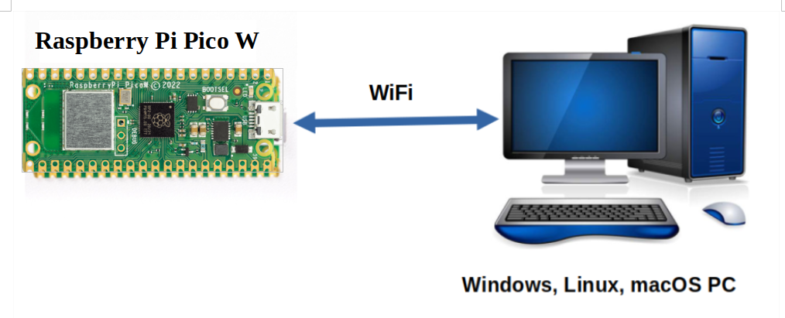

<div style="text-align:center;color:#990033; font-family:times, serif;font-size:2.5em"><i>The Telemetrix User's Guide</i></div>
<div style="text-align:center;color:#990033; font-family:times, serif;font-size:2.5em"><i>For The</i></div>
<div style="text-align:center;color:#990033; font-family:times, serif;font-size:2.5em"><i>Raspberry Pi Pico W  </i></div>

<br>



*Telemetry* is a system for collecting data on a remote device and then 
automatically transmitting the collected data back to local receiving equipment for 
processing. The Telemetrix Project for the Raspberry Pi Pico W does just that and more.

With Telemetrix, you can do things such as establish a GPIO pin as a PWM output pin, and 
set its value to run a DC motor, perhaps select the pin as a control
pin for a NeoPixel strip or communicate with your favorite i2c device. 
All within a Python application.

Telemetrix gives the appearance that the Pico W is being _programmed_, but in fact, the 
Pico is running a fixed application and is not programmed in the 
traditional sense. Instead, a Python application is written using a
[Traditional Python API](https://htmlpreview.github.io/?https://github.com/MrYsLab/telemetrix-rpi-pico-w/blob/master/html/telemetrix_rpi_pico_w/index.html)
or [Python asyncio API.](https://htmlpreview.github.io/?https://github.com/MrYsLab/telemetrix-rpi-pico-w/blob/master/html/telemetrix_rpi_pico_w_aio/index.html)
and communicates with the Pico W over WIFI.

Telemetrix automatically reports input data changes to the Python application using a 
callback mechanism, ensuring that the 
application receives the latest data changes quickly and that no data changes are lost.


## A Working Example   

Here is a Telemetrix example that monitors several digital input pins:

```python
import sys
import time

from telemetrix_rpi_pico_w import telemetrix_rpi_pico_w

"""
Monitor 4 digital input pins with pull-up enabled for each
"""


# Callback data indices
# When the callback function is called, the client fills in 
# the data parameter. Data is a list of values, and the following are 
# indexes into the list to retrieve report information

CB_PIN_MODE = 0 # The mode of the reporting pin (input, output, PWM, etc.)
CB_PIN = 1      # The GPIO pin number associated with this report
CB_VALUE = 2    # The data value reported
CB_TIME = 3     # A time stamp when the data change occurred


def the_callback(data):
    """
    A callback function to report data changes.
    This will print the pin number, its reported value and
    the date and time when the change occurred
    :param data: [pin mode, pin, current reported value, pin_mode, timestamp]
    """
    date = time.strftime('%Y-%m-%d %H:%M:%S', time.localtime(data[CB_TIME]))
    print(f'Report Type: {data[CB_PIN_MODE]} Pin: {data[CB_PIN]} '
          f'Value: {data[CB_VALUE]} Time Stamp: {date}')


board = telemetrix_rpi_pico_w.TelemetrixRpiPicoW()
board.set_pin_mode_digital_input_pullup(12, the_callback)
board.set_pin_mode_digital_input_pullup(13, the_callback)
board.set_pin_mode_digital_input_pullup(14, the_callback)
board.set_pin_mode_digital_input_pullup(15, the_callback)

try:
    while True:
        time.sleep(.0001)
except KeyboardInterrupt:
    board.shutdown()
    sys.exit(0)
```

And here is some sample output:

```python
TelemetrixRpiPicoW:  Version 1.0

Copyright (c) 2022 Alan Yorinks All Rights Reserved.

Retrieving Telemetrix4pico firmware ID...
Telemetrix4pico firmware version: 1.0
Report Type: 2 Pin: 12 Value: 1 Time Stamp: 2022-03-14 13:34:52
Report Type: 2 Pin: 13 Value: 1 Time Stamp: 2022-03-14 13:34:52
Report Type: 2 Pin: 14 Value: 1 Time Stamp: 2022-03-14 13:34:52
Report Type: 2 Pin: 15 Value: 1 Time Stamp: 2022-03-14 13:34:52
Report Type: 2 Pin: 13 Value: 0 Time Stamp: 2022-03-14 13:35:21
Report Type: 2 Pin: 13 Value: 1 Time Stamp: 2022-03-14 13:35:22
Report Type: 2 Pin: 14 Value: 0 Time Stamp: 2022-03-14 13:35:29
Report Type: 2 Pin: 14 Value: 1 Time Stamp: 2022-03-14 13:35:31
Report Type: 2 Pin: 15 Value: 0 Time Stamp: 2022-03-14 13:35:33
Report Type: 2 Pin: 15 Value: 1 Time Stamp: 2022-03-14 13:35:34


```


 
## The Telemetrix Client/Server Model

Telemetrix for the Raspberry Pi Pico W consists of two main components.

The first component is a fixed resident Pico server, implemented using 
[The arduino-pico library](https://github.com/earlephilhower/arduino-pico). 
Once the server is installed on the Pico, no additional code is generated or 
uploaded to the Pico.

The second component is a Python client application, written using a
telemetrix-rpi-pico-w Python API. WIFI is used to transport commands and responses 
between client and server.

There are two Python client APIs from which to choose. The difference between the two is
concurrency implementation.

The [telemetrix_rpi_pico_w](https://github.
com/MrYsLab/telemetrix-rpi-pico-w/tree/master/telemetrix_rpi_pico_w)
API is implemented using Python threading, and 
the [telemetrix_rpi_pico_w_aio](https://github.
com/MrYsLab/telemetrix-rpi-pico-w/tree/master/telemetrix_rpi_pico_w_aio)
API uses Python asyncio for concurrency.

They both utilize the same server and support similar features.

<br>

# Summary Of Major Features

* Applications are programmed using conventional Python 3.7 or greater.
* All Data change events are reported asynchronously via user-registered callback 
  functions. 
* Each data change event is time-stamped.
* Online API Reference Documentation is provided:
    * For the [Threaded Python Client.](https://htmlpreview.github.io/?https://github.com/MrYsLab/telemetrix-rpi-pico-w/blob/master/html/telemetrix_rpi_pico_w/index.html)
    * For the [Asyncio Python Client.](https://htmlpreview.github.io/?https://github.com/MrYsLab/telemetrix-rpi-pico-w/blob/master/html/telemetrix_rpi_pico_w_aio/index.html)
* A complete set of working examples is provided for both [traditional Python](https://github.com/MrYsLab/telemetrix-rpi-pico-w/tree/master/examples) and the 
  [asyncio version.](https://github.com/MrYsLab/telemetrix-rpi-pico-w/tree/master/examples_aio)
* Integrated debugging methods are included as part of the Pico Server 
  SDK source code to aid in adding new features.


Copyright (C) 2022 Alan Yorinks. All Rights Reserved.

**Last updated 15 September 2022**
