# Telemetrix4RpiPicoW

## Install the Arduino IDE on your PC.
The Arduino IDE is used to fetch, compile and upload the Telemetrix4RpiPicoW server code. 

Install the Arduino IDE 2.0.0 on your PC. 
Please follow the steps on the [Arduino IDE Download](https://www.arduino.cc/en/software) 
page.

Open the Arduino IDE.

## Add A Download Path To the Arduino-Pico Board Library For The IDE
Please follow 
[these instructions](https://github.com/earlephilhower/arduino-pico#installing-via-arduino-boards-manager)
describing the installation process using the **Arduino Library Manager**.

## Power Your Raspberry Pi Pico W

Connect a USB cable to the Raspberry Pi Pico W and plug the cable into a USB port on 
your computer.

## Install The Raspberry Pi Pico W Board Library Into The IDE

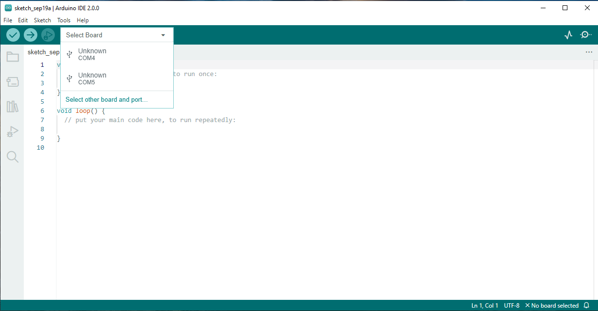

Click on the _Select Board_ drop-down list, and click on _Select other board and port_...

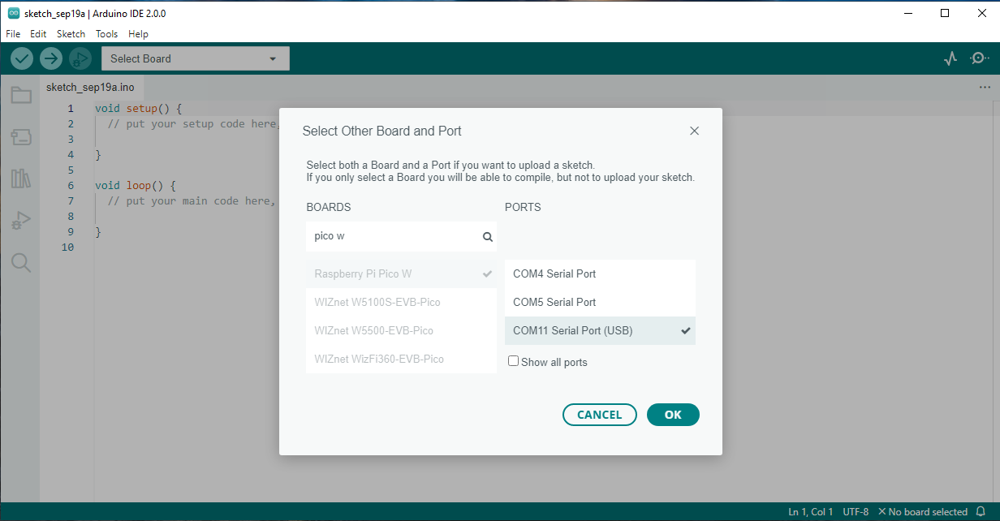
The _Select Other Board and Port_ dialog box appears. In the search box, 
type Pico W. Select Raspberry Pico W by clicking on the selection, and also select the 
USB port. Click **OK**.

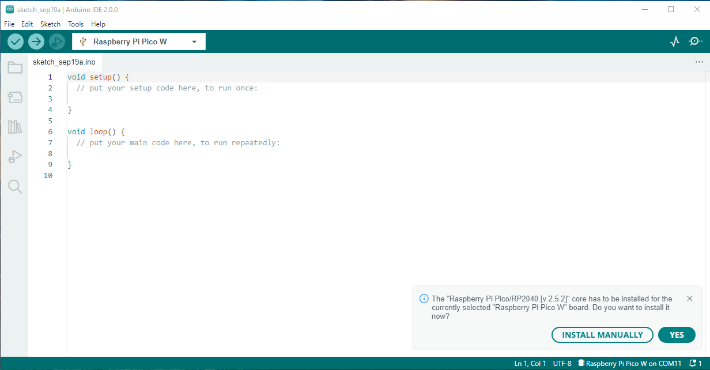

In the lower right corner, a **board manager install** dialog will appear. Click **YES**.

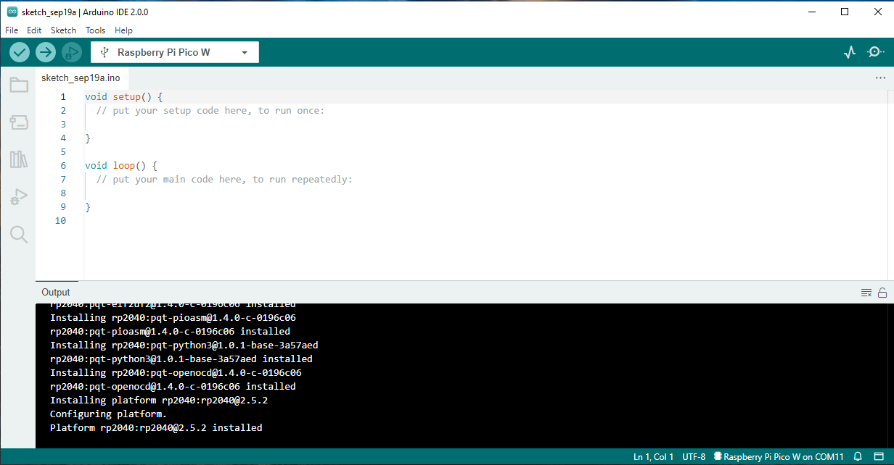

After the board manager installs, Raspberry Pi Pico W is displayed in the board 
selection drop-down box, and the USB port selection is shown at the lower right.

## Install The Telemetrix4RpiPicoW Library Into The IDE

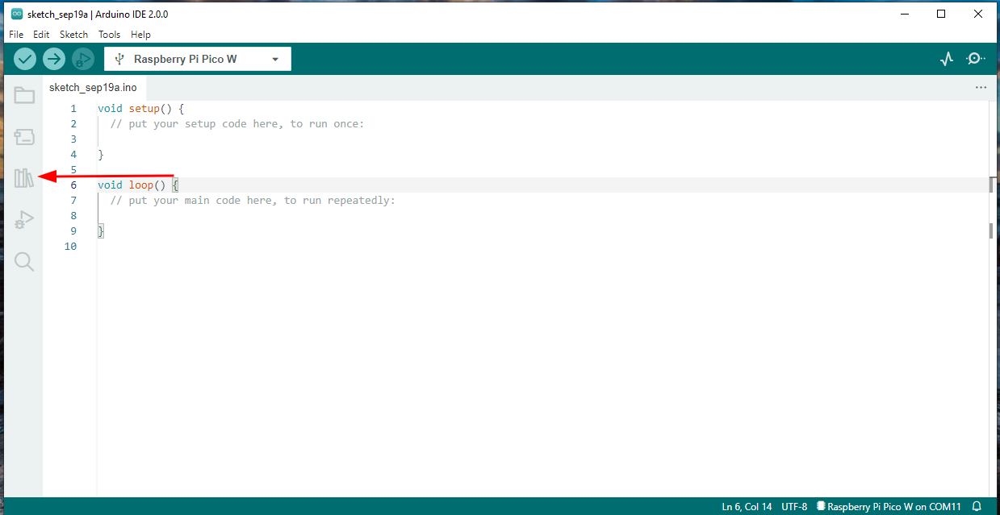

Click on the Library Manager icon on the left side of the IDE.

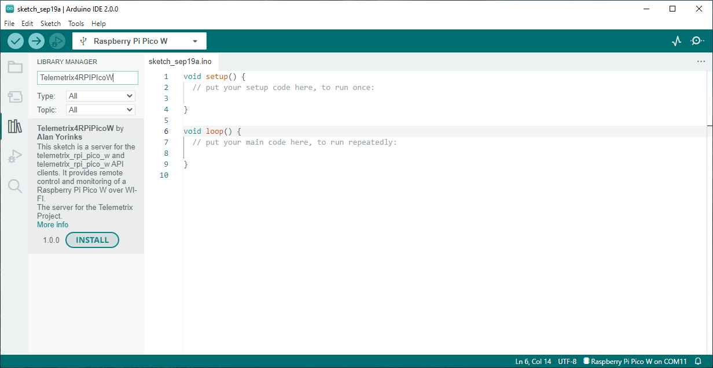

Type _Telemetrix4RpiPicoW_ in the search box and then click **INSTALL**.

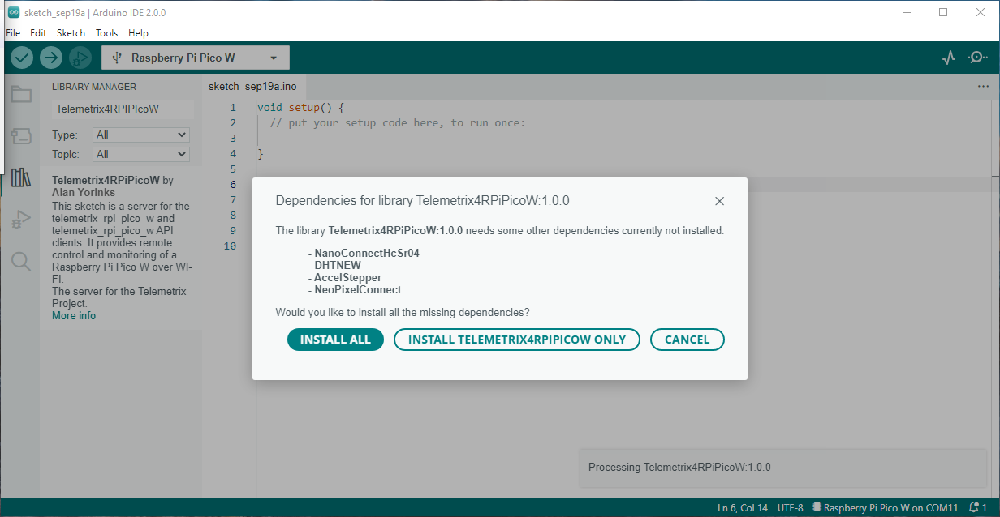

Click on **INSTALL ALL** to install dependencies.

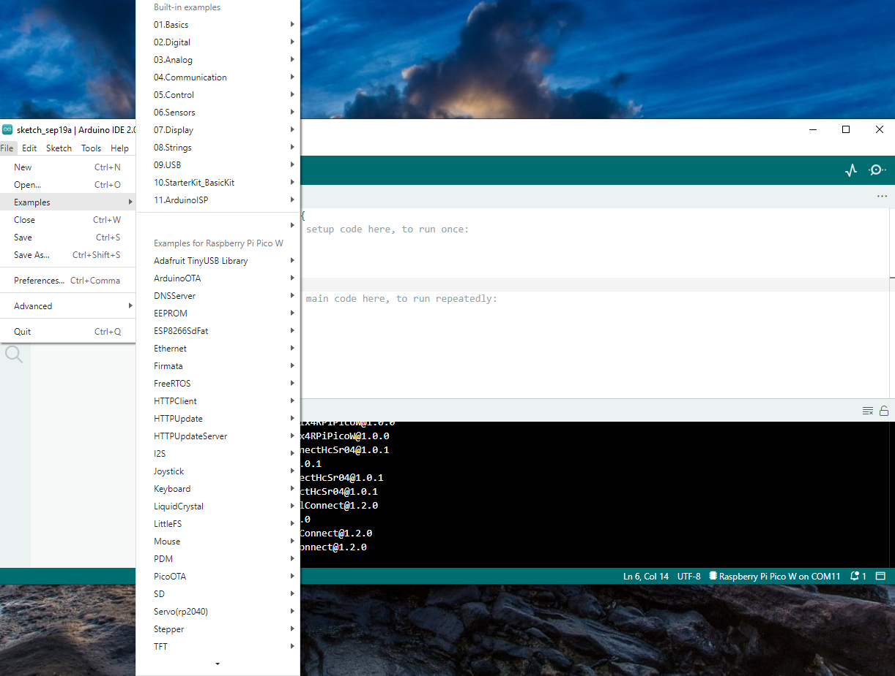

Select File/Examples from the IDE main menu.

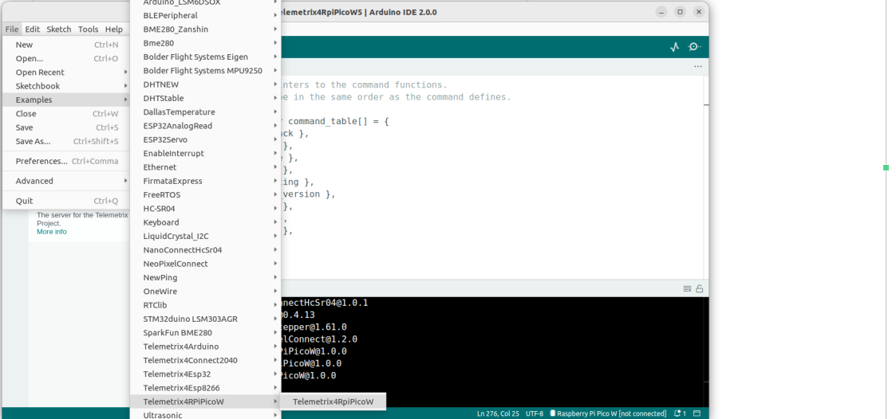

Scroll down, and select Telemetrix4RpiPicoW

## Edit The Source Code For Your Network SSID and Password

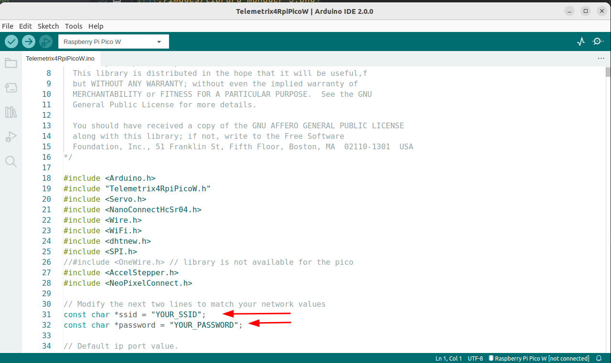

Modify the file by replacing YOUR_SSID with the SSID of your network and replacing 
YOUR_PASSWORD with your network password. Be sure to include the quotation marks.

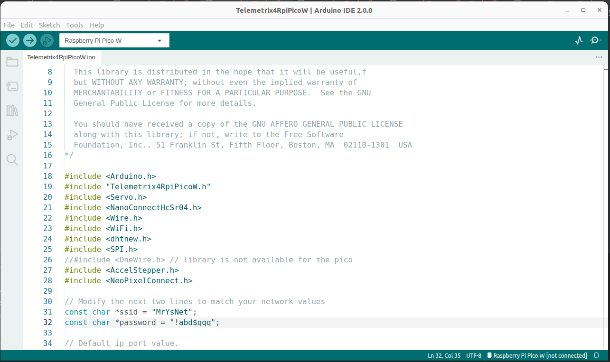

After making your changes, click on File/Save. 

## Compile and Upload Telemetrix4RpiPicoW

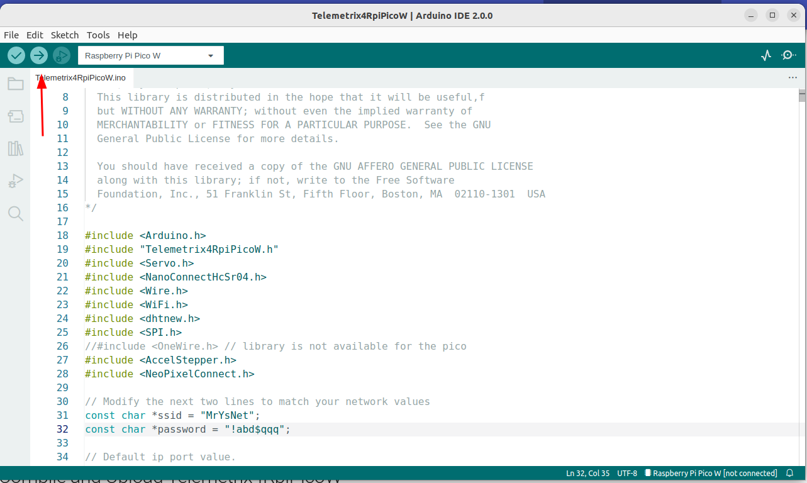

Click on the Upload button in the upper left of the IDE to compile and install 
the server.

If you get an error message similar to the one below, click on Tools/Port, select 
your USB port, and click on Upload again.

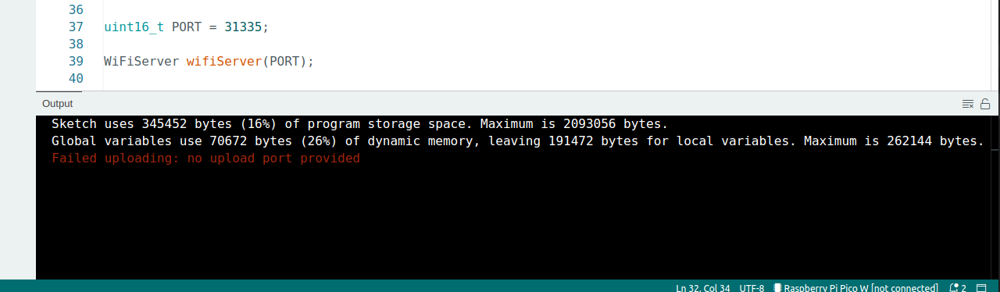

## Retrieving The IP Address Assigned To The Raspberry Pi Pico W By The Router
After compiling and uploading, the Green Board LED will light up for approximately 15 seconds.
The LED is automatically turned off when a successful connection is made with your router.

If you are using DHCP to have your router select the IP address, you can view the 
assigned IP address using your router's administration Web Page and find an entry named 
Telemetrix_pico_w.

You may also the Arduino IDE Serial Monitor to the IP address assigned. Because the 
Arduino IDE disconnects the USB port after an upload, we need to extend the startup 
delay in Telemetrix4RpiPicoW from 0.5 seconds to a larger number to allow both the 
selection of
the USB port and to be able to start the Serial Monitor before the connection is made. 
To do this,
we need to modify an additional line of code.

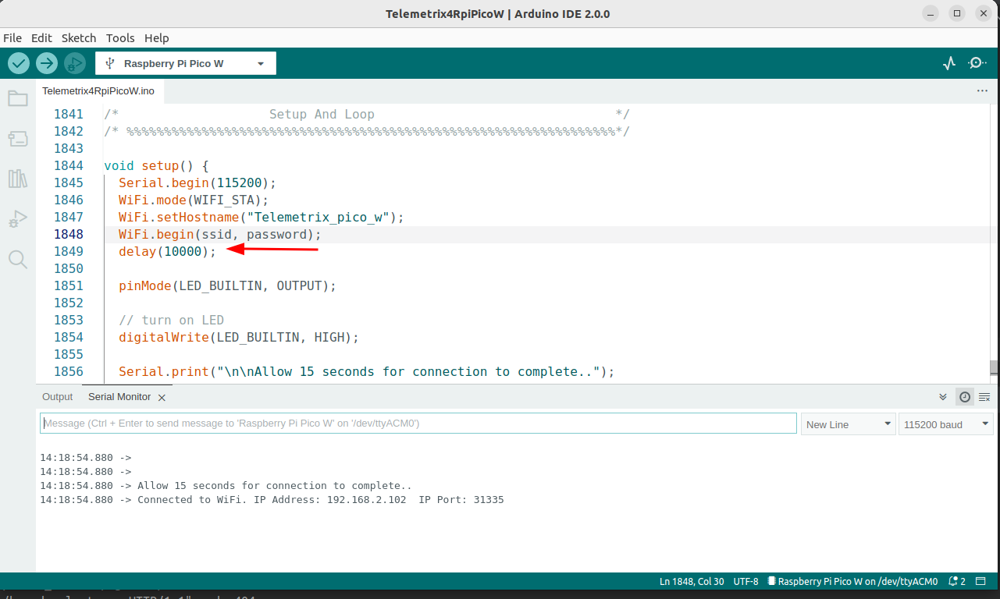

Here the startup delay was extended from the original 0.5 seconds to 10 seconds by 
setting the delay value to 10000. Save and upload again.

Repower the Pico W, select the USB port by going into Tools/Port and
open the Serial Monitor by clicking on the Serial Monitor button.

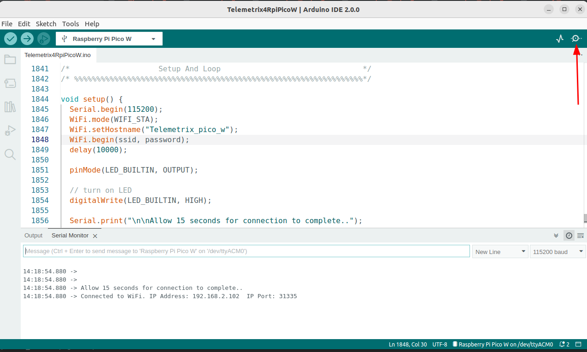

In 15 seconds, you should see the IP address displayed in the Serial Monitor when 
the delay expires.

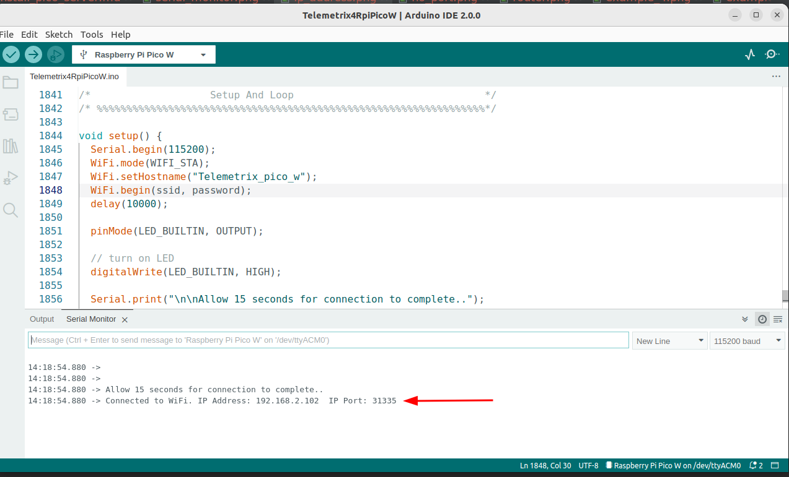

Write down the assigned IP address, set the delay to 500, and save and upload again.

 
 
Copyright (C) 2022 Alan Yorinks. All Rights Reserved.
